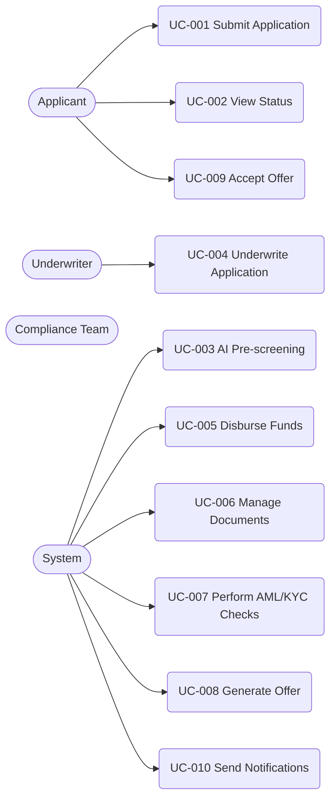

# Use Case Diagram

## Metadata

| Field | Value |
|---|---|
| Initiative ID | I021-NEXT21 |
| Created at | 2026-06-17T17:40:00+00:00 |
| Created by | product-owner |
| Status | Draft |

## Use Case Diagram

## UC Catalog

| UC-NNN | Title | Primary Actor(s) | FR Sources |
|---|---|---|---|
| UC-001 | Submit Application | Applicant | FR-001, FR-002, FR-003 |
| UC-002 | View Application Status | Applicant | FR-005 |
| UC-003 | AI Pre-screening | System | FR-006, FR-007, FR-008 |
| UC-004 | Underwrite Application | Underwriter | FR-015, FR-017 |
| UC-005 | Disburse Funds | System | FR-024, FR-025 |
| UC-006 | Manage Documents | Applicant / System | FR-021, FR-022 |
| UC-007 | Perform AML/KYC Checks | System / Compliance Team | FR-012, FR-013, FR-014 |
| UC-008 | Generate Offer | System | FR-019, FR-020 |
| UC-009 | Accept Offer | Applicant | FR-021, FR-022 |
| UC-010 | Send Notifications | System | FR-004, FR-027 |

## Coverage Notes

This use case set maps to the primary lifecycle: intake → pre-screen → underwriting → offer → disbursement. It traces FR clusters to specific UCs; none are intentionally excluded.

---

*Set Status: Accepted only by human approval when required by the workflow. Never self-accept.*
