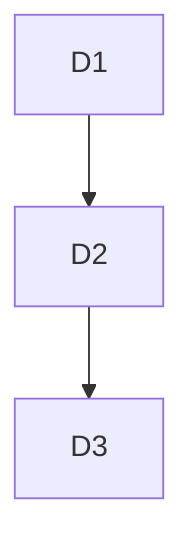

# Delivery Increments

## Metadata

| Field | Value |
|---|---|
| Initiative ID | I021-NEXT21 |
| Created at | 2026-06-17T18:40:00+00:00 |
| Created by | delivery-lead |
| Status | Draft |

## Overview

This document defines delivery increments (D1, D2, D3) with entry/exit criteria, dependencies and effort sizing.

## Increments

### D1 — Minimal Viable Intake & Decision

- Scope: Intake form, basic validation, score calculation (MOD-001, MOD-002), auto-decision for low-risk cases, decision recording (ENT-003).
- Entry criteria: Requirements FR-001..FR-010 defined; Intake API skeleton available.
- Exit criteria: End-to-end acceptance test for simple auto-approve flows; basic observability in place.
- Estimated effort: 3 sprints (8 story points per sprint placeholder).

### D2 — Underwriter Workbench & Offer Generation

- Scope: Underwriter UI (MOD-003), offer generation (ENT-004), document upload (ENT-006), integrations for KYC.
- Entry criteria: D1 complete and stable; integration adapters agreed.
- Exit criteria: Underwriter can process referred cases; offer documents generated and stored.
- Estimated effort: 4 sprints.

### D3 — Disbursement & External Integrations

- Scope: Disbursement service (MOD-004), T24 adapter, audit/logging (ENT-007), reliability hardening.
- Entry criteria: D2 complete; test harness for T24 integration available.
- Exit criteria: Successful end-to-end disbursement in staging; SLA targets met.
- Estimated effort: 3 sprints.

## Dependency Graph

## Coverage Summary

- All primary FRs are partitioned across increments; detailed mapping in the traceability matrix.

## Notes

- Increments are subject to refinement during sprint planning. Story-level mapping will be produced in the delivery plan.
