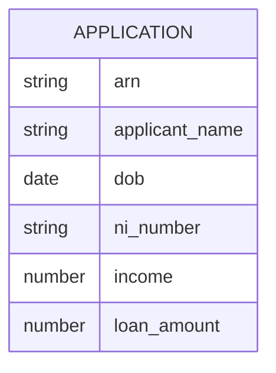

# Implementation Contract — E-001 Application Intake

Owner: Product / Delivery

Scope:
- Implement public intake form, API endpoints, ARN assignment service, confirmation email.

Done Criteria:
- End-to-end submission flow demonstrated in a staging environment.
- Tests for mandatory fields and ARN uniqueness.

Interfaces:
- Intake API -> Scoring queue
- Notification service for confirmation email

## Data Entities

- Application: {arn, applicant_name, dob, ni_number, income, loan_amount, purpose, term}



## API Surface

- POST /intake - accept application payload and return ARN
- GET /status?arn={arn}&dob={dob} - return application status

```yaml
openapi: 3.0.0
info:
	title: Intake API
	version: 1.0.0
paths:
	/intake:
		post:
			summary: Submit application
			responses:
				'200':
					description: ARN returned
	/status:
		get:
			summary: Get status by ARN
			responses:
				'200':
					description: Status payload
```

## Events

- ApplicationSubmitted(event): emitted when intake accepted, containing ARN and applicant id

## Business Rules

- Mandatory fields must be present before acceptance (see FR-001)

