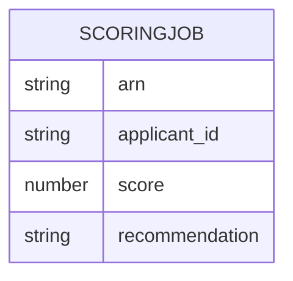

# Implementation Contract — E-002 AI Pre-screening

Owner: AI Platform / Delivery

Scope:
- Model hosting, scoring API, explainability payload, Experian integration.

## Data Entities

- ScoringJob: {arn, applicant_id, score, recommendation, explainability}



## API Surface

- POST /scoring - submit job and return job id

```yaml
openapi: 3.0.0
info:
  title: Scoring API
  version: 1.0.0
paths:
  /scoring:
    post:
      summary: Submit scoring job
      responses:
        '202':
          description: Job accepted
```

## Events

- ScoringRequested(event)

## Business Rules

- Scoring must complete within 60s under nominal load (FR-006)
