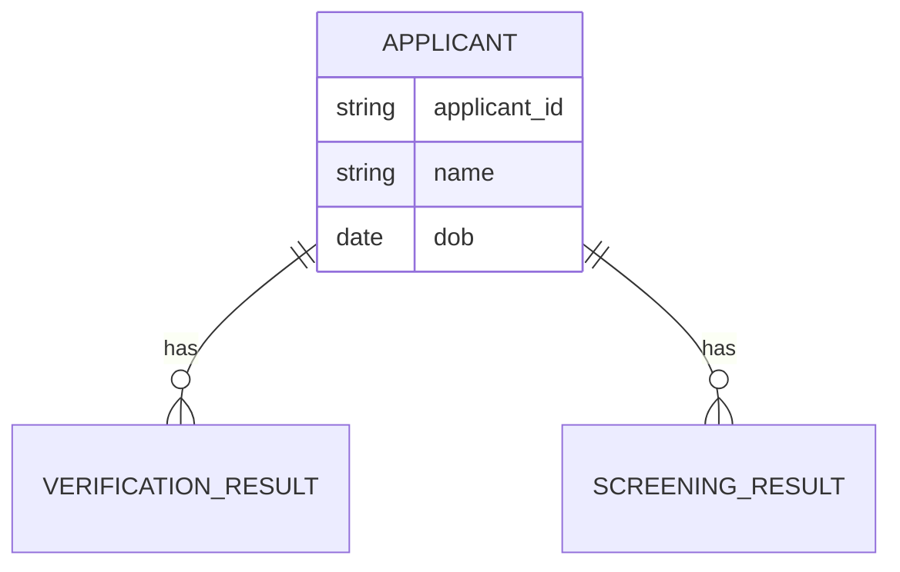

# Implementation Contract — E-003 AML/KYC Compliance

## Data Entities

- Applicant: identifier, name, date_of_birth, national_id, documents[]
- VerificationResult: applicant_id, vendor, status, confidence, details
- ScreeningResult: applicant_id, sanction_matches, pep_matches, score



## API Surface

- POST /api/applications/{applicationId}/verify — submit documents for identity verification
- GET /api/applications/{applicationId}/verification — retrieve verification result
- POST /api/applications/{applicationId}/screen — trigger AML screening

```yaml
openapi: "3.0.1"
info:
	title: AML/KYC API
	version: "1.0.0"
paths:
	/api/applications/{applicationId}/verify:
		post:
			summary: Submit documents for identity verification
			parameters:
				- name: applicationId
					in: path
					required: true
					schema:
						type: string
			responses:
				'200':
					description: Verification accepted
```

## Events

- ApplicantVerified(vendor, applicant_id, status, confidence)
- ApplicantScreened(applicant_id, score, matches[])
- HighRiskApplicantDetected(applicant_id, reason)

## Business Rules

- If VerificationResult.status == "failed" then mark application as "needs_manual_review".
- If ScreeningResult.score >= 80 or sanction_matches present then create reviewer task and set application risk=High.

## Non-Functional Constraints

- Verification calls must complete within 10s under normal load; implement retries with exponential backoff for vendor errors.
- Sensitive PII must be stored encrypted at rest and masked in logs.
