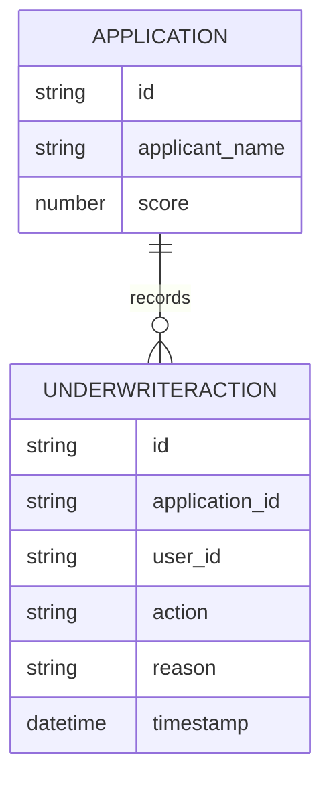

# Implementation Contract

## Data Entities

- Application (id, applicant_name, score, referral_reason)
- UnderwriterAction (id, application_id, user_id, action, reason, timestamp)



## API Surface

### GET /underwriter/queue
Returns paginated list of referred applications with score and links.

```yaml
openapi: 3.0.0
info:
	title: Underwriter API
	version: 1.0.0
paths:
	/underwriter/queue:
		get:
			summary: Get referral queue
			responses:
				'200':
					description: OK
```

### POST /underwriter/{application_id}/action
Records underwriter action with reason.

## Events

- underwriter.action.recorded (ApplicationId, Action, UserId, Timestamp)
