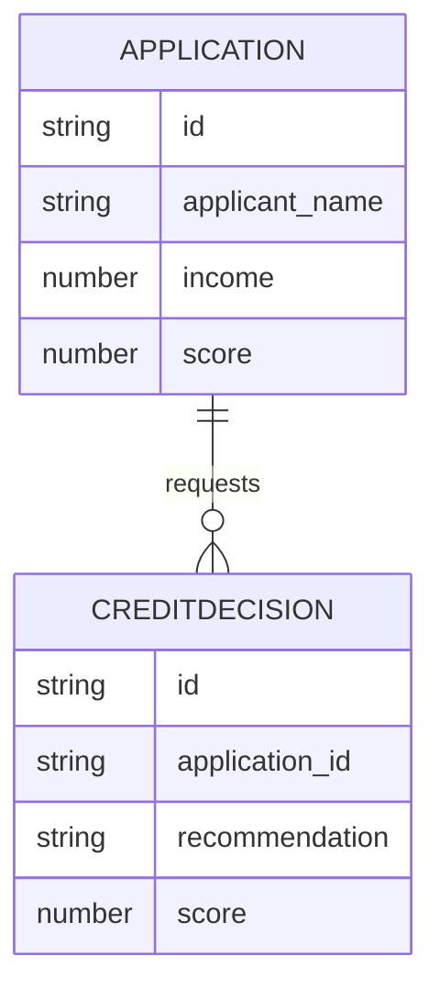

# Implementation Contract

## Data Entities

- Application (id, applicant_name, income, score)



## API Surface

### POST /credit/score
Accepts applicant data and returns decision recommendations.

```yaml
openapi: 3.0.0
info:
	title: Credit Decision API
	version: 1.0.0
paths:
	/credit/score:
		post:
			summary: Request credit decision
			requestBody:
				required: true
			responses:
				'200':
					description: OK
```

## Events

- credit.decision.requested (ApplicationId, Score, Recommendation)
