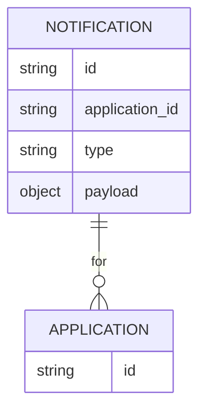

# Implementation Contract

## Data Entities

- Notification (id, application_id, type, payload)



## API Surface

### POST /notifications/send
Accepts notification payload and dispatches to channel providers.

```yaml
openapi: 3.0.0
info:
	title: Notification API
	version: 1.0.0
paths:
	/notifications/send:
		post:
			summary: Send notification
			responses:
				'200':
					description: OK
```

## Events

- notification.sent (NotificationId, ApplicationId, Channel)
