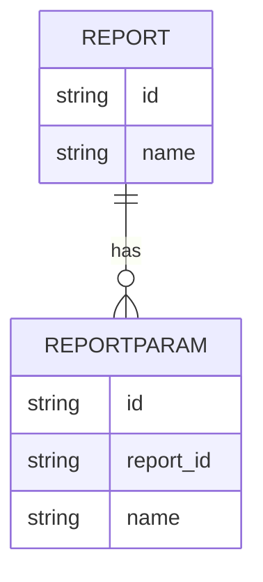

# Implementation Contract

## Data Entities

- Report (id, name, parameters)



## API Surface

### GET /reports/{id}
Returns generated report data.

```yaml
openapi: 3.0.0
info:
	title: Reporting API
	version: 1.0.0
paths:
	/reports/{id}:
		get:
			summary: Get report
			parameters:
				- in: path
					name: id
					required: true
			responses:
				'200':
					description: OK
```

## Events

- report.generated (ReportId, GeneratedAt)
