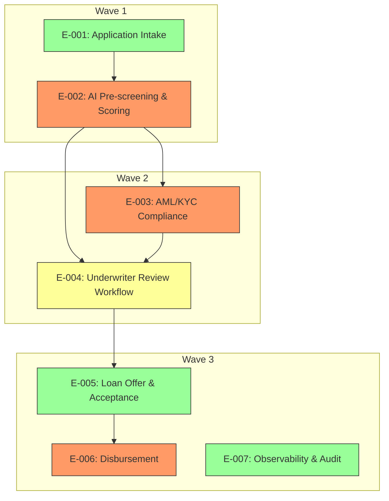

# Elaboration Plan

## Metadata

| Field | Value |
|---|---|
| Initiative ID | I093-I3 |
| Created at | 2026-06-22 |
| Created by | delivery-lead |
| Status | Draft |

---

## Elaboration Strategy Summary

| Metric | Value |
|---|---|
| Total epics | 7 |
| Elaboration waves | 3 |
| Parallelizable epics | 2 |
| Critical path epics | 2 |
| Highest risk epic | E-002 |

---

## Prioritisation Criteria

| Factor | Weight | Rationale |
|---|---|---|
| Business priority (Must > Should > Could) | High | Focus on must-have capabilities first to unblock value delivery |
| Architecture risk (from architecture-risks) | High | High-risk AI scoring and integration work should be early to de-risk |
| Cross-cutting concerns (from architecture-impact-map) | Medium | Security, compliance and integration concerns affect many epics |
| Dependency count (blocking others) | Medium | Reduce blockers by sequencing dependent epics earlier |
| Standalone capability (can deliver independently) | Low | Standalone epics can be parallelised to accelerate throughput |

---

## Elaboration Order

### Wave 1 — Core Intake and Scoring

| Epic | Title | Rationale | Risk Level | Dependencies | Parallel? |
|---|---|---|---|---|---|
| E-001 | Application Intake | Needed to capture applicants and unblock downstream flows | Medium | None | No |
| E-002 | AI Pre-screening & Scoring | High architecture risk; requires early model decisions and integrations | High | E-001 | No |

### Wave 2 — Compliance and Underwriting

| Epic | Title | Rationale | Risk Level | Dependencies | Parallel? |
|---|---|---|---|---|---|
| E-003 | AML/KYC Compliance | Regulatory gating; must be available before offers | High | E-002 | No |
| E-004 | Underwriter Review Workflow | Human-in-loop decisioning depends on scoring and AML | Medium | E-002, E-003 | Yes |

### Wave 3 — Offer, Disbursement, Observability

| Epic | Title | Rationale | Risk Level | Dependencies | Parallel? |
|---|---|---|---|---|---|
| E-005 | Loan Offer & Acceptance | Dependent on underwriting and compliance | Medium | E-004 | Yes |
| E-006 | Disbursement | Core banking integration; schedule after offer flows defined | High | E-005 | No |
| E-007 | Observability & Audit | Cross-cutting, can be worked in parallel where feasible | Low | E-001..E-006 | Yes |

---

## Epic Dependency Analysis

| Epic | Depends On | Depended On By | Cross-Cutting Concerns | Architecture Risk |
|---|---|---|---|---|
| E-001 | None | E-002 | Frontend, Data validation | Medium |
| E-002 | E-001 | E-003, E-004 | Model explainability, Experian integration | High |
| E-003 | E-002 | E-004 | AML/KYC provider availability | High |

---

## Parallel Elaboration Opportunities

| Group | Epics | Rationale | Constraint |
|---|---|---|---|
| Observability & Audit | E-007 | Observability can be scaffolded early and iteratively enriched | Cross-cutting schema changes may require coordination |
| Underwriting + Offer | E-004, E-005 | Underwriter UI and offer generation can be worked by separate squads | Shared data contracts for applicant summary |

---

## Elaboration Dependency Diagram

---

## Risks and Mitigations

| Risk | Impact | Mitigation |
|---|---|---|
| AI model vendor delay | High | Confirm vendor or fallback model; plan PoC in sprint 1 |
| Experian/HMRC integration SLAs | High | Implement circuit-breakers and fallback routing to underwriter |
| Core banking API unknowns | High | Early engagement with T24 owners; stub contracts for testing |

---

## Recommendations

Focus wave 1 on `E-001` and `E-002` to validate the AI scoring approach and integrations. Run a two-sprint spike for the AI scoring pipeline and Experian integration to de-risk the critical path. Parallelise `E-004` and `E-005` once `E-002` provides stable scoring outputs and `E-003` compliance checks are available.

---
*This is a human-gated artifact. The delivery lead must review and approve the elaboration order before epic and story elaboration proceeds. Adjust wave assignments and parallel groupings based on team capacity and constraints. Set Status: Accepted only after human review. Never self-accept.*
