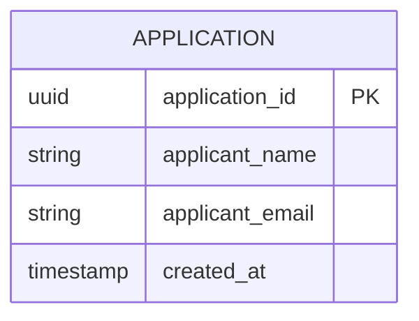

# Implementation Contract — E-001 Application Intake

## Data Entities

### Application



| Field | Type | Required | Constraints | Source |
|---|---|---|---|---|
| application_id | uuid | Yes | RFC4122 UUID | REQ-001 |
| applicant_name | string | Yes | max 255 | REQ-001 |
| applicant_email | string | Yes | email format | REQ-002 |
| created_at | timestamp | Yes | ISO 8601 | REQ-001 |

## API Surface

```yaml
openapi: "3.0.3"
info:
  title: "Application Intake API"
  version: "1.0.0"
paths:
  /api/v1/applications:
    post:
      summary: "Submit application"
      operationId: "submitApplication"
      requestBody:
        required: true
        content:
          application/json:
            schema:
              type: object
              properties:
                applicant_name:
                  type: string
                applicant_email:
                  type: string
      responses:
        "201":
          description: "Created - returns ARN"
```

## Events

| Event | Type | Producer | Consumers | Trigger |
|---|---|---|---|---|
| application.submitted | domain | Applicant Portal | Scoring, Compliance, Audit | On successful submission |

**Payload:**

| Field | Type | Required | Description |
|---|---|---|---|
| application_id | uuid | Yes | Submission identifier |
| applicant_email | string | Yes | Contact email |

Delivery: at-least-once

## Business Rules

| Rule | Condition | Effect | Source |
|---|---|---|---|
| R-001 | required fields present | accept submission | REQ-001 |

## Non-Functional Constraints

| Constraint | Target | Source |
|---|---|---|
| Storage in UK region | Uploaded documents | AR-001 |

---
*Include only relevant sections.*
