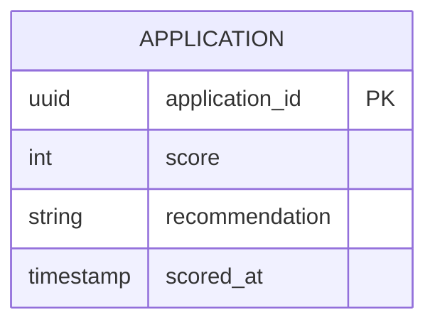

# Implementation Contract — E-002 AI Pre-Screening & Risk Scoring

## Data Entities



## API Surface

```yaml
openapi: "3.0.3"
info:
  title: "Scoring API"
  version: "1.0.0"
paths:
  /api/v1/score:
    post:
      summary: "Invoke scoring for an application"
      requestBody:
        required: true
      responses:
        "200":
          description: "Score produced"
```

## Events

| Event | Type | Producer | Consumers | Trigger |
|---|---|---|---|---|
| application.scored | domain | Scoring Service | Underwriter, Offer Generator, Audit | When scoring completes |
