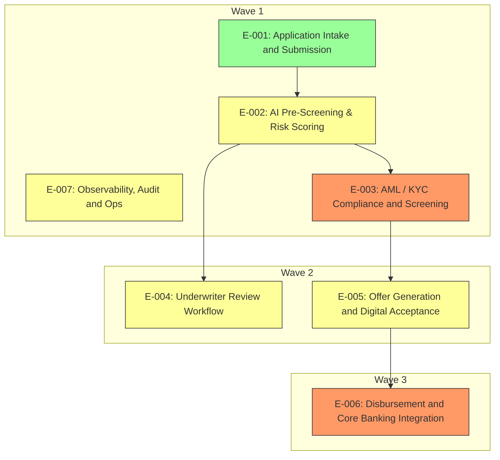

# Elaboration Plan

## Metadata

| Field | Value |
|---|---|
| Initiative ID | I111-N11 |
| Created at | 2026-06-22 |
| Created by | delivery-lead |
| Status | Draft |

## Summary

This plan orders epic elaboration into waves that balance foundation needs, architectural risk, and business priority. High-risk and foundational epics are scheduled first to surface unknowns early.

## Elaboration Strategy Summary

We prioritise stabilising event and API contracts early (foundation-first), prototype high-risk components (risk-first), and then sequence business-critical UI and offer capabilities. Observability is staged early to ensure traceability during prototyping and integration testing.
This approach reduces downstream churn and accelerates discovery of external-integration and compliance risks before teams invest heavily in UI or disbursement work.

## Elaboration Order

| Wave | Epics |
|---|---|
| Wave 1 (Foundation + Risk-first) | E-001, E-002, E-003, E-007 |
| Wave 2 (Business-critical) | E-004, E-005 |
| Wave 3 (High-sensitivity integration) | E-006 |

## Rationale for Ordering

- Foundation-first: `E-001` (Application Intake) provides the event and data contract that all downstream scoring and compliance components consume; it must be elaborated early to stabilise APIs and event shapes.
- Risk-first: `E-002` (AI Scoring) and `E-003` (AML/KYC) carry medium–high to high architectural risk (external APIs, model explainability). Placing them early enables rapid prototyping and regulatory validation (see ARCH-002).
- Observability early: `E-007` is placed in Wave 1 so traceability, correlation IDs, and immutable audit patterns are defined before downstream elaboration.
- Separation: Underwriter UX (`E-004`) and Offer Generation (`E-005`) depend on scoring and compliance outputs and therefore are scheduled in Wave 2. Disbursement (`E-006`) depends on Offer and external T24 contract readiness, so it is Wave 3 to avoid blocking early delivery.

## Parallel Elaboration Opportunities

- Wave 1 parallel groups:
  - `E-001` (Intake) and `E-007` (Observability) can be elaborated in parallel (different teams: frontend + platform) because they have minimal mutual design coupling.
  - `E-002` (Scoring) and `E-003` (AML/KYC) should be elaborated after `E-001`'s API shape is finalised; they may be worked in parallel once intake contracts are stable.
- Wave 2 parallelism: `E-004` and `E-005` can be elaborated in parallel for UI/workflow versus document/template design; both rely on scoring/compliance outputs but do not block each other's design in most cases.

## Elaboration Dependency Diagram

## Epic Dependency Analysis

| Epic | Depends On | Downstream Consumers | Cross-cutting Concerns | Risk (from architecture-review) |
|---|---|---|---|---|
| E-001 | None | E-002, E-004 | API shape, event contracts | Low-Medium |
| E-002 | E-001 | E-003, E-004, E-005 | Model explainability, Experian integration | Medium |
| E-003 | E-002 | E-005 | HMRC/HM Treasury integration, compliance | High |
| E-004 | E-002, E-003 | Offer workflow | UI patterns, audit capture | Medium |
| E-005 | E-003 | E-006 | Offer templates, DocuSign callbacks | Medium (T24 dependency later increases risk) |
| E-006 | E-005 | Core banking (settlement) | T24 contract surface, financial ledger sensitivity | High |
| E-007 | All | All | Audit, observability, correlationId, retention | Medium |

## Risks and Mitigations

| Risk | Likelihood | Impact | Mitigation |
|---|---|---|---|
| T24 contract delay (DEC-002) | Medium | High | Early contract engagement; adapter spike; mock harness |
| Model explainability requirement change (DEC-001 / ARCH-002) | Medium | High | Prototype explainability hooks; compliance review in Wave 1 |
| Experian latency | Medium | Medium | Circuit-breaker, REFER_TO_UNDERWRITER fallback, scale scoring infra |
## Prioritisation Criteria and Weights

- Foundation-first (40%): Prevent downstream churn by stabilising APIs and event contracts early.
- Risk-first (30%): Surface high architectural and regulatory risks early to reduce rework cost.
- Business-priority (20%): Ensure Must-priority epics are available early for early value.
- Parallelism (10%): Optimise team throughput by identifying non-blocking work.

Rationale references: See `architecture/architecture-review.md` for risk assessments (Performance NFR-002, Security NFR-004, Integration NFR-007) and `planning/delivery-skeleton.md` for epic priorities.

## Recommendations (2–3 sentences)

Start with Wave 1 focused elaboration: stabilise `E-001` API contracts, prototype `E-002` explainability, and implement `E-007` observability scaffolding. This exposes integration and regulatory risks early; follow with Wave 2 UI and offer elaboration, and reserve disbursement (`E-006`) for Wave 3 pending T24 contract finalisation.

## Risks & Mitigations (summary)

| Risk | Likelihood | Impact | Mitigation |
|---|---|---|---|
| T24 contract delay | Medium | High | Early contract engagement; adapter spike; mock harness |
| Model explainability requirement change | Medium | High | Prototype explainability hooks; compliance review in Wave 1 |
| Experian latency | Medium | Medium | Circuit-breaker, REFER_TO_UNDERWRITER fallback, scale scoring infra |

---
*Set Status: Draft.*
