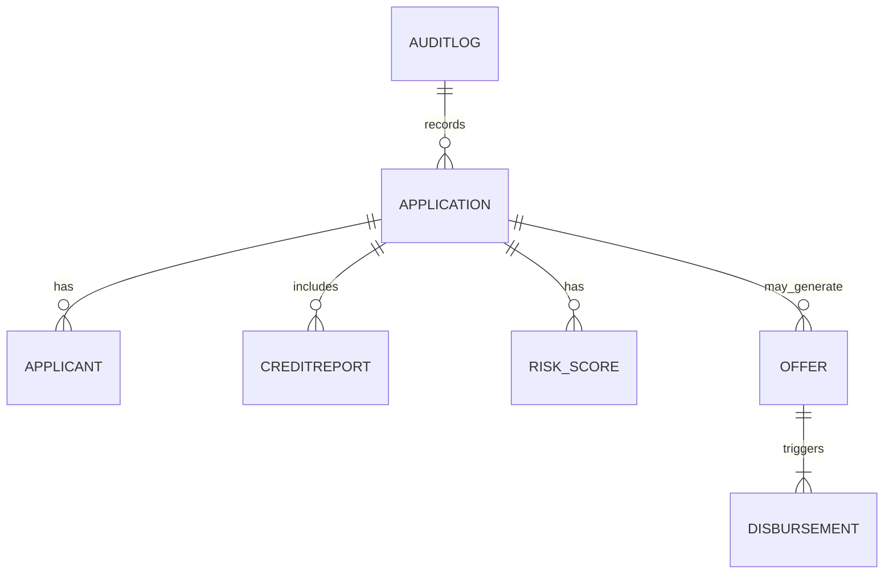

# Entity Model

This document lists primary domain entities and key attributes for the Loan Origination Platform.

## Entity Catalog

| ID | Entity | Key attributes | Notes |
|---|---|---|---|
| ENT-001 | Application | ARN, applicant_id, amount, term, status, created_at | Core record for each loan application |
| ENT-002 | Applicant | applicant_id, name, dob, national_insurance, contact | Linked to Application |
| ENT-003 | CreditReport | report_id, score, bureau, fetched_at | From Experian CreditExpert |
| ENT-004 | RiskScore | score (0-1000), model_version, factors | Produced by AI pre-screening |
| ENT-005 | Offer | offer_id, amount, apr, monthly_payment, valid_until | Generated on approval |
| ENT-006 | Disbursement | disbursement_id, account_number, sort_code, amount, status | Sent to Temenos T24 |
| ENT-007 | AuditLog | entry_id, artifact, previous_state, new_state, actor, timestamp | Immutable write-once store |

## ER Diagram

Detailed entity sections follow below.

### ENT-001 — Application

- Description: Core record representing a loan application.
- Key attributes: `ARN`, `applicant_id`, `amount`, `term`, `status`, `created_at`, `updated_at`.

### ENT-002 — Applicant

- Description: Person applying for a loan.
- Key attributes: `applicant_id`, `name`, `dob`, `national_insurance`, `contact_email`, `contact_phone`.

### ENT-003 — CreditReport

- Description: External credit report fetched from Experian.
- Key attributes: `report_id`, `score`, `bureau`, `fetched_at`, `raw_report_reference`.

### ENT-004 — RiskScore

- Description: AI-produced risk score and associated explanatory factors.
- Key attributes: `score`, `model_version`, `factors`, `generated_at`.

### ENT-005 — Offer

- Description: Generated loan offer document and terms.
- Key attributes: `offer_id`, `application_arn`, `amount`, `apr`, `monthly_payment`, `valid_until`.

### ENT-006 — Disbursement

- Description: Disbursement instruction sent to core banking.
- Key attributes: `disbursement_id`, `offer_id`, `account_number`, `sort_code`, `amount`, `status`.

### ENT-007 — AuditLog

- Description: Immutable log of state transitions and decisions.
- Key attributes: `entry_id`, `artifact`, `previous_state`, `new_state`, `actor`, `timestamp`, `snapshot`.

