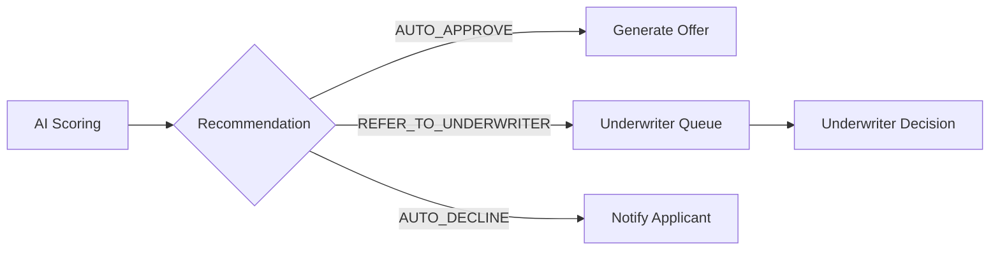
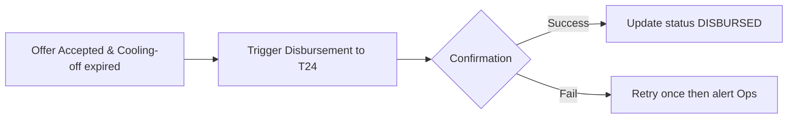

# Process Flows

## Overview

This document captures high-level process flows for key lifecycles: Application Intake, AI Scoring & Screening, Underwriter Review, and Disbursement.

## Application Intake Flow

```mermaid
flowchart LR
  A[Applicant fills form] --> B{Validation OK}
  B -- No --> C[Show inline errors]
  B -- Yes --> D[Create Application (ARN)] --> E[Trigger AI pre-screening]
```

## AI Scoring & Screening Flow



## Disbursement Flow



## Source FRs

- FR-001..FR-030 (as relevant per flow)
