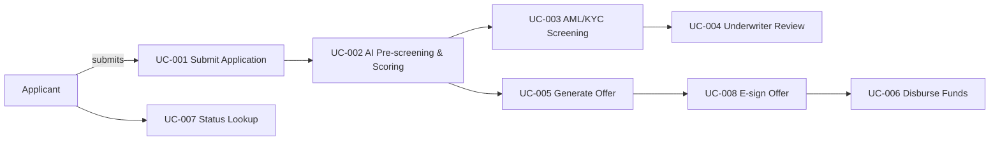

# Use Cases

This diagram captures the primary use cases for the Loan Origination Platform.

See `use-cases.puml` for the PlantUML visual representation.

## Use Case Catalog

| ID | Title | Source FRs | Notes |
|---|---|---|---|
| UC-001 | Submit Application | FR-001, FR-002, FR-003, FR-004 | Applicant intake and ARN generation |
| UC-002 | AI Pre-screening & Scoring | FR-006, FR-007 | Scoring, recommendation generation |
| UC-003 | AML/KYC Screening | FR-012, FR-013, FR-014 | Compliance screening and holds |
| UC-004 | Underwriter Review | FR-015, FR-016, FR-017 | Human review workflow and audit trail |
| UC-005 | Generate Offer | FR-020, FR-021 | Offer document generation and delivery |
| UC-006 | Disburse Funds | FR-024, FR-025, FR-026 | Trigger disbursement to core banking |
| UC-007 | Status Lookup | FR-005 | Applicant status retrieval by ARN |
| UC-008 | E-sign Offer | FR-022 | DocuSign acceptance and logging |

