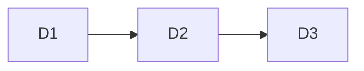

# Delivery Increments

## Metadata

| Field | Value |
|---|---|
| Initiative ID | I111-NEXT11 |
| Execution mode | Enterprise+Modular |
| Created at | 2026-06-18 |
| Created by | Delivery Lead |
| Status | Draft |

## Increment Summary

| Increment ID | Name | Story Count | Must / Should / Could | Key Dependencies |
|---|---|---|---|---|
| D1 | Core increment | 3 | Must / Should / Could | None |
| D2 | Integration increment | 4 | Must / Should / Could | D1 |

## D1: Increment Name

| Field | Value |
|---|---|
| Scope | FR-001, FR-002 |
| Entry criteria | Requirements and module boundaries defined |
| Exit criteria | Stories refined and planned |
| Dependencies | None |
| Estimated team effort | Medium |
| Quality gate requirements | Architecture review passed |

## Cross-Increment Dependency Graph

---
*This artifact is only applicable in `Enterprise+Modular` execution mode.*
