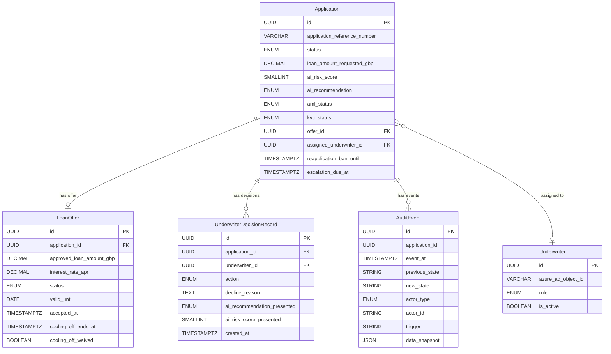
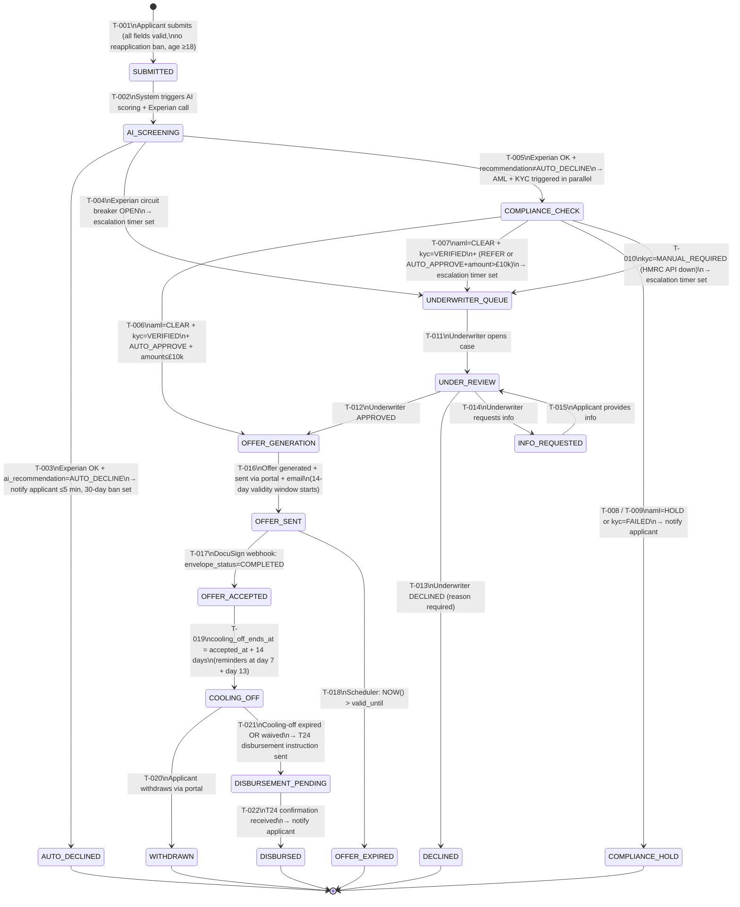

# Domain Model — AI-Powered Loan Origination Platform

## Metadata

| Field | Value |
|---|---|
| Initiative ID | I982-ISA |
| Created at | 2026-07-02 |
| Status | Draft |
| BRS Sources | FR-001 to FR-030, NFR-001 to NFR-007, Architecture constraints |

---

## Entity Catalog

| ID | Name | Description | PII | BRS Source |
|---|---|---|---|---|
| ENT-001 | Application | Central entity representing a personal loan application lifecycle, from submission through to disbursement or terminal decline | Yes | FR-001 to FR-030 |
| ENT-002 | LoanOffer | Generated loan offer with terms presented to applicant; financial terms are immutable after generation | No | FR-020, FR-021, FR-022, FR-023, FR-024 |
| ENT-003 | UnderwriterDecisionRecord | Immutable record of each underwriter action — APPROVED, DECLINED, or INFO_REQUESTED | No | FR-018 |
| ENT-004 | AuditEvent | Append-only record of every application state transition; written to Cosmos DB | Partial (data_snapshot is PII-restricted) | FR-028, FR-030, NFR-005 |
| ENT-005 | Underwriter | Bank employee authorised to review loan applications | Yes (name) | FR-016 to FR-019 |

---

## ENT-001: Application

**Description:** Drives the entire loan lifecycle state machine. Every service reads and writes to this entity via the Loan Origination API state machine endpoint — no direct database writes are permitted by other services.

**Owner:** Loan Origination API (Azure App Service — .NET 8 / ASP.NET Core)

**Storage:** Azure SQL (Hyperscale)

**PII fields (encrypted at rest — AES-256, Azure-managed keys, NFR-004):**
`full_name`, `date_of_birth`, `national_insurance_number`, `applicant_email`, `applicant_ip_address`

### Attributes

| Attribute | Type | Nullable | Constraints | Notes |
|---|---|---|---|---|
| id | UUID | No | PK, immutable | System-generated on creation |
| application_reference_number | VARCHAR(25) | No | UNIQUE, immutable | Format: `ARN-{YYYYMMDD}-{8 random alphanumeric uppercase}`. Displayed to applicant (FR-003) |
| full_name | VARCHAR(200) | No | NOT NULL | PII — encrypted at rest |
| date_of_birth | DATE | No | NOT NULL, applicant must be ≥18 at submitted_at | PII — encrypted at rest |
| national_insurance_number | VARCHAR(9) | No | NOT NULL, regex: `[A-CEGHJ-PR-TW-Z][A-CEGHJ-NPR-TW-Z][0-9]{6}[A-D]` | PII — encrypted at rest |
| applicant_email | VARCHAR(320) | No | NOT NULL, valid RFC 5321 email | PII — encrypted at rest. Used for notifications (FR-004, FR-011, FR-027) |
| applicant_ip_address | VARCHAR(45) | No | NOT NULL | PII — IPv4 or IPv6 captured at submission |
| employment_status | ENUM | No | Values: `EMPLOYED_FULL_TIME`, `EMPLOYED_PART_TIME`, `SELF_EMPLOYED`, `UNEMPLOYED`, `RETIRED`, `OTHER` | FR-001 |
| annual_income_gbp | DECIMAL(12,2) | No | NOT NULL, > 0 | GBP |
| loan_amount_requested_gbp | DECIMAL(10,2) | No | NOT NULL, 1000.00 ≤ value ≤ 50000.00 | FR-001 |
| loan_purpose | VARCHAR(500) | No | NOT NULL | FR-001 |
| repayment_term_months | SMALLINT | No | NOT NULL, IN (12, 18, 24, 36, 48, 60, 72, 84) | FR-001 |
| status | ENUM | No | NOT NULL, see state machine section | Current state in lifecycle |
| submitted_at | TIMESTAMPTZ | No | NOT NULL, immutable | UTC; set on creation |
| ai_risk_score | SMALLINT | Yes | 0–1000 | Written once by AI Scoring Service (FR-007); not subsequently modifiable |
| ai_recommendation | ENUM | Yes | Values: `AUTO_APPROVE`, `REFER_TO_UNDERWRITER`, `AUTO_DECLINE` | Written once by AI Scoring Service (FR-007) |
| ai_explanation_ref | VARCHAR(500) | Yes | | Reference to explainability artefact stored in blob (FCA constraint — black-box models not permitted) |
| experian_report_ref | VARCHAR(100) | Yes | | Reference ID only — raw credit report NOT persisted (architecture.md: discarded after scoring) |
| debt_to_income_ratio | DECIMAL(5,4) | Yes | | Computed by AI Scoring Service (FR-008); stored for audit and underwriter display |
| loan_to_income_ratio | DECIMAL(5,4) | Yes | | Computed by AI Scoring Service (FR-008); stored for audit and underwriter display |
| aml_status | ENUM | No | NOT NULL, default `PENDING` | Values: `PENDING`, `CLEAR`, `HOLD` |
| kyc_status | ENUM | No | NOT NULL, default `PENDING` | Values: `PENDING`, `VERIFIED`, `FAILED`, `MANUAL_REQUIRED` |
| compliance_hold_reason | VARCHAR(50) | Yes | Required when aml_status=`HOLD` or kyc_status=`FAILED` or kyc_status=`MANUAL_REQUIRED` | Values: `AML_SANCTIONS_MATCH`, `AML_PEP_MATCH`, `KYC_NI_MISMATCH`, `KYC_NAME_MISMATCH`, `KYC_DOB_MISMATCH`, `HMRC_API_UNAVAILABLE` |
| assigned_underwriter_id | UUID | Yes | FK → ENT-005.id | Set when application enters `UNDER_REVIEW` |
| offer_id | UUID | Yes | FK → ENT-002.id | Set when offer is generated |
| reapplication_ban_until | TIMESTAMPTZ | Yes | | Set to `submitted_at + 30 days` on transition to `AUTO_DECLINED` (FR-011). Enforced at submission: reject if `NOW() < reapplication_ban_until` for same NI number |
| escalation_due_at | TIMESTAMPTZ | Yes | | Set to `(entered_underwriter_queue_at + 4 business hours)` on T-008/T-011/T-004. Business hours: 08:00–20:00 GMT Mon–Fri (FR-019) |
| last_status_changed_at | TIMESTAMPTZ | No | NOT NULL | Updated on every state transition |
| created_at | TIMESTAMPTZ | No | NOT NULL, immutable | Same as submitted_at |
| updated_at | TIMESTAMPTZ | No | NOT NULL | Updated on any field change |

### Indexes required

```sql
-- Applicant status lookup (FR-005: ARN + DOB lookup, no registration required)
CREATE UNIQUE INDEX idx_application_arn ON application(application_reference_number);
CREATE INDEX idx_application_arn_dob ON application(application_reference_number, date_of_birth);

-- Reapplication cooling-off enforcement (BR-005)
CREATE INDEX idx_application_ni_ban ON application(national_insurance_number, reapplication_ban_until)
  WHERE reapplication_ban_until IS NOT NULL;

-- Underwriter queue operations
CREATE INDEX idx_application_status ON application(status);
CREATE INDEX idx_application_escalation ON application(escalation_due_at)
  WHERE status = 'UNDERWRITER_QUEUE' AND escalation_due_at IS NOT NULL;
```

---

## ENT-002: LoanOffer

**Description:** Created once per approved application. Core financial terms (amounts, rates, terms) are immutable after generation. Only status and acceptance fields are updated.

**Owner:** Loan Origination API

**Storage:** Azure SQL (Hyperscale)

**PII:** No (applicant referenced via application_id FK only)

### Attributes

| Attribute | Type | Nullable | Constraints | Notes |
|---|---|---|---|---|
| id | UUID | No | PK, immutable | |
| application_id | UUID | No | NOT NULL, FK → ENT-001.id | |
| approved_loan_amount_gbp | DECIMAL(10,2) | No | NOT NULL, immutable | |
| interest_rate_apr | DECIMAL(6,4) | No | NOT NULL, immutable | Stored as decimal (e.g., 0.0699 = 6.99% APR) |
| monthly_repayment_gbp | DECIMAL(10,2) | No | NOT NULL, immutable | |
| total_repayable_gbp | DECIMAL(10,2) | No | NOT NULL, immutable | |
| repayment_term_months | SMALLINT | No | NOT NULL, immutable | |
| terms_version | VARCHAR(20) | No | NOT NULL, immutable | Version identifier of T&C document shown to applicant at acceptance |
| valid_until | DATE | No | NOT NULL, immutable | `generated_at::DATE + 14 days` (FR-021) |
| generated_at | TIMESTAMPTZ | No | NOT NULL, immutable | |
| status | ENUM | No | NOT NULL | Values: `PENDING_SEND`, `SENT`, `ACCEPTED`, `EXPIRED`, `WITHDRAWN` |
| docusign_envelope_id | VARCHAR(100) | Yes | | Populated when DocuSign envelope created (FR-022) |
| accepted_at | TIMESTAMPTZ | Yes | | Set on DocuSign webhook `COMPLETED` event |
| acceptance_ip_address | VARCHAR(45) | Yes | | Captured from DocuSign webhook or applicant portal session (FR-022) |
| cooling_off_ends_at | TIMESTAMPTZ | Yes | | Set to `accepted_at + 14 days` on acceptance (FR-023) |
| cooling_off_waived | BOOLEAN | No | NOT NULL, default FALSE | Applicant waiver via portal action (OQ-002 resolved: no separate legal sign-off required) |
| withdrawn_at | TIMESTAMPTZ | Yes | | Set if applicant withdraws during cooling-off (FR-023) |

---

## ENT-003: UnderwriterDecisionRecord

**Description:** Immutable record of each underwriter action on an application. One row per action. Rows are NEVER updated or deleted. Satisfies FR-018 requirement for immutable underwriter audit record.

**Owner:** Loan Origination API (write-once insert only)

**Storage:** Azure SQL (separate table with write-only role for application service account)

**Immutability enforcement:** The SQL application user has INSERT-only permission on this table. No UPDATE or DELETE statements are permitted. Azure SQL row-level security policy enforces this constraint.

### Attributes

| Attribute | Type | Nullable | Constraints | Notes |
|---|---|---|---|---|
| id | UUID | No | PK, immutable | |
| application_id | UUID | No | NOT NULL, FK → ENT-001.id | |
| underwriter_id | UUID | No | NOT NULL, FK → ENT-005.id | |
| action | ENUM | No | NOT NULL | Values: `APPROVED`, `DECLINED`, `INFO_REQUESTED` |
| conditions | TEXT | Yes | | Required only if action = `APPROVED` and conditions were set |
| decline_reason | TEXT | Yes | REQUIRED (NOT NULL) when action = `DECLINED` | FR-017 mandates mandatory reason for all declines |
| ai_recommendation_presented | ENUM | No | NOT NULL, immutable | The AI recommendation shown to the underwriter at review time (FR-018) |
| ai_risk_score_presented | SMALLINT | No | NOT NULL, immutable | The AI score shown to the underwriter at review time (FR-018) |
| created_at | TIMESTAMPTZ | No | NOT NULL, immutable | |

---

## ENT-004: AuditEvent

**Description:** Append-only record of every application state transition. Written to Azure Cosmos DB (append-only container, TTL disabled). Satisfies FR-028 (immutable audit trail) and NFR-005 (write-once, tamper-evident).

**Owner:** Audit Log Store (Azure Cosmos DB)

**Storage:** Azure Cosmos DB, container `audit-events`, partition key: `application_id`

**Immutability enforcement:** Container has no stored procedures for update/delete. The Audit Writer managed identity has insert-only access. No other service identity has write access. The Loan Origination API writes one AuditEvent synchronously as part of every state transition (before returning HTTP response to caller) — see BR-014.

**PII policy:** PII fields (`full_name`, `national_insurance_number`, `date_of_birth`, `applicant_email`) are NEVER included in `data_snapshot`. Access to the `audit-events` container requires elevated RBAC role (per architecture.md security model).

### Attributes

| Attribute | Type | Notes |
|---|---|---|
| id | UUID | PK, immutable |
| application_id | UUID | Cosmos DB partition key |
| event_at | ISO 8601 TIMESTAMPTZ | UTC; immutable |
| previous_state | STRING | Application status before transition; `"NONE"` for the initial SUBMITTED event |
| new_state | STRING | Application status after transition |
| actor_type | ENUM | `APPLICANT`, `AI_MODEL`, `UNDERWRITER`, `COMPLIANCE_OFFICER`, `PAYMENT_GATEWAY`, `SYSTEM` |
| actor_id | STRING | Nullable. Underwriter.id for `UNDERWRITER` events; Azure AD OID for compliance officers; null for AI_MODEL, PAYMENT_GATEWAY, SYSTEM |
| trigger | STRING | Human-readable description of what caused this transition |
| data_snapshot | JSON | Relevant non-PII fields at time of transition — see table below |
| schema_version | STRING | `"1.0"` default; used for forward compatibility |

### data_snapshot by event type

| Transition (previous → new) | Snapshot fields |
|---|---|
| NONE → SUBMITTED | `{ arn, loan_amount_requested_gbp, loan_purpose, repayment_term_months, employment_status, annual_income_gbp }` |
| SUBMITTED → AI_SCREENING | `{ arn }` |
| AI_SCREENING → AUTO_DECLINED | `{ ai_risk_score, ai_recommendation }` |
| AI_SCREENING → COMPLIANCE_CHECK | `{ ai_risk_score, ai_recommendation, debt_to_income_ratio, loan_to_income_ratio, experian_report_ref }` |
| AI_SCREENING → UNDERWRITER_QUEUE | `{ trigger: "Experian circuit breaker open — fallback REFER_TO_UNDERWRITER" }` |
| COMPLIANCE_CHECK → COMPLIANCE_HOLD | `{ aml_status, kyc_status, compliance_hold_reason }` |
| COMPLIANCE_CHECK → OFFER_GENERATION | `{ aml_status, kyc_status, ai_recommendation }` |
| COMPLIANCE_CHECK → UNDERWRITER_QUEUE | `{ aml_status, kyc_status, ai_recommendation, loan_amount_requested_gbp }` |
| UNDERWRITER_QUEUE → UNDER_REVIEW | `{ assigned_underwriter_id }` |
| UNDER_REVIEW → OFFER_GENERATION | `{ underwriter_decision_record_id, conditions }` |
| UNDER_REVIEW → DECLINED | `{ underwriter_decision_record_id, decline_reason_category }` |
| UNDER_REVIEW → INFO_REQUESTED | `{ underwriter_decision_record_id }` |
| INFO_REQUESTED → UNDER_REVIEW | `{}` |
| OFFER_GENERATION → OFFER_SENT | `{ offer_id, valid_until, approved_loan_amount_gbp, interest_rate_apr }` |
| OFFER_SENT → OFFER_ACCEPTED | `{ offer_id, docusign_envelope_id, cooling_off_ends_at }` |
| OFFER_SENT → OFFER_EXPIRED | `{ offer_id, valid_until }` |
| OFFER_ACCEPTED → COOLING_OFF | `{ cooling_off_ends_at }` |
| COOLING_OFF → WITHDRAWN | `{ withdrawn_at }` |
| COOLING_OFF → DISBURSEMENT_PENDING | `{ disbursement_idempotency_key, cooling_off_waived }` |
| DISBURSEMENT_PENDING → DISBURSED | `{ t24_confirmation_ref, disbursed_at, value_date }` |

---

## ENT-005: Underwriter

**Description:** Bank employee authorised to review and decide on loan applications. Linked to enterprise Azure AD IdP.

**Owner:** Loan Origination API

**Storage:** Azure SQL (Hyperscale)

**PII:** Yes — `full_name`

### Attributes

| Attribute | Type | Nullable | Constraints | Notes |
|---|---|---|---|---|
| id | UUID | No | PK | |
| azure_ad_object_id | VARCHAR(36) | No | UNIQUE, NOT NULL | Links to Azure AD (architecture.md: underwriter auth via Azure AD RBAC) |
| employee_id | VARCHAR(20) | No | UNIQUE, NOT NULL | Bank HR system reference |
| full_name | VARCHAR(200) | No | NOT NULL | PII |
| role | ENUM | No | NOT NULL | Values: `UNDERWRITER`, `SENIOR_UNDERWRITER`, `TEAM_LEAD` |
| is_active | BOOLEAN | No | NOT NULL, default TRUE | Set FALSE on deactivation; records retained for audit |
| created_at | TIMESTAMPTZ | No | NOT NULL, immutable | |

---

## Application State Machine

### State Definitions

| State | Description | Terminal? | SLA |
|---|---|---|---|
| `SUBMITTED` | Application received; ARN assigned; confirmation email queued | No | — |
| `AI_SCREENING` | Experian CreditExpert call in flight + AI scoring in progress | No | ≤90s end-to-end (NFR-002) |
| `COMPLIANCE_CHECK` | AML (HM Treasury sanctions/PEP) + KYC (HMRC) running in parallel | No | ≤60s per check (FR-012) |
| `AUTO_DECLINED` | AI recommendation was AUTO_DECLINE; applicant notified ≤5 min; 30-day reapplication ban set | **Yes** | Notification ≤5 min (FR-011) |
| `DECLINED` | Underwriter declined; applicant notified | **Yes** | — |
| `COMPLIANCE_HOLD` | AML or KYC failed; compliance team action required; applicant notified (FR-014) | No* | — |
| `UNDERWRITER_QUEUE` | Application queued for underwriter review; 4-hour escalation timer started | No | Queued ≤2 min after AI scoring (FR-015) |
| `UNDER_REVIEW` | Underwriter has opened case in dashboard | No | — |
| `INFO_REQUESTED` | Underwriter requested additional information from applicant | No | — |
| `OFFER_GENERATION` | Offer document being computed | No | — |
| `OFFER_SENT` | Offer sent to applicant via portal + email; 14-day validity window started | No | — |
| `OFFER_ACCEPTED` | DocuSign e-signature confirmed; cooling-off period starting | No | — |
| `COOLING_OFF` | 14-day withdrawal window active; reminders sent at day 7 and day 13 | No | — |
| `WITHDRAWN` | Applicant withdrew during cooling-off period | **Yes** | — |
| `OFFER_EXPIRED` | 14-day offer acceptance window elapsed without acceptance | **Yes** | — |
| `DISBURSEMENT_PENDING` | Disbursement instruction sent to T24; awaiting confirmation | No | Confirmation ≤2 min; 1 retry (FR-026) |
| `DISBURSED` | T24 disbursement confirmed; applicant notified | **Yes** | — |

*`COMPLIANCE_HOLD` is effectively terminal for automated processing; can only be resolved by compliance team via admin API. No automated transition out.

### State Transition Table

| ID | From | To | Guard Condition | Actor | Idempotency | BRS Ref |
|---|---|---|---|---|---|---|
| T-001 | `—` | `SUBMITTED` | All mandatory fields valid; NI number format valid; applicant ≥18 years old; reapplication ban not active | `APPLICANT` | Idempotency-Key header required | FR-001, FR-003 |
| T-002 | `SUBMITTED` | `AI_SCREENING` | Unconditional — triggered immediately on T-001 completion | `SYSTEM` | N/A (system-internal) | FR-006 |
| T-003 | `AI_SCREENING` | `AUTO_DECLINED` | Experian available AND `ai_recommendation = AUTO_DECLINE` | `AI_MODEL` (via AI Scoring Service event on Service Bus) | Yes | FR-011 |
| T-004 | `AI_SCREENING` | `UNDERWRITER_QUEUE` | Experian circuit breaker OPEN (Service Bus event from AI Scoring Service on timeout/fallback) | `SYSTEM` | Yes | FR-009 |
| T-005 | `AI_SCREENING` | `COMPLIANCE_CHECK` | Experian available AND `ai_recommendation ≠ AUTO_DECLINE` | `AI_MODEL` (via AI Scoring Service event) | Yes | FR-009, FR-012 |
| T-006 | `COMPLIANCE_CHECK` | `OFFER_GENERATION` | `aml_status = CLEAR` AND `kyc_status = VERIFIED` AND `ai_recommendation = AUTO_APPROVE` AND `loan_amount_requested_gbp ≤ 10000.00` | `SYSTEM` (Compliance Service event) | Yes | FR-010 |
| T-007 | `COMPLIANCE_CHECK` | `UNDERWRITER_QUEUE` | `aml_status = CLEAR` AND `kyc_status = VERIFIED` AND (`ai_recommendation = REFER_TO_UNDERWRITER` OR (`ai_recommendation = AUTO_APPROVE` AND `loan_amount_requested_gbp > 10000.00`)) | `SYSTEM` (Compliance Service event) | Yes | FR-010, FR-015 |
| T-008 | `COMPLIANCE_CHECK` | `COMPLIANCE_HOLD` | `aml_status = HOLD` (AML sanctions or PEP match) | `COMPLIANCE_SERVICE` | Yes | FR-014 |
| T-009 | `COMPLIANCE_CHECK` | `COMPLIANCE_HOLD` | `kyc_status = FAILED` (HMRC cross-reference mismatch) | `COMPLIANCE_SERVICE` | Yes | FR-014 |
| T-010 | `COMPLIANCE_CHECK` | `UNDERWRITER_QUEUE` | `kyc_status = MANUAL_REQUIRED` (HMRC API unavailable) | `COMPLIANCE_SERVICE` | Yes | FR-013, OQ-003 |
| T-011 | `UNDERWRITER_QUEUE` | `UNDER_REVIEW` | Underwriter opens application from dashboard | `UNDERWRITER` | Yes | FR-016 |
| T-012 | `UNDER_REVIEW` | `OFFER_GENERATION` | Underwriter action = `APPROVED` | `UNDERWRITER` | Yes | FR-017 |
| T-013 | `UNDER_REVIEW` | `DECLINED` | Underwriter action = `DECLINED` AND `decline_reason` is non-empty | `UNDERWRITER` | Yes | FR-017 |
| T-014 | `UNDER_REVIEW` | `INFO_REQUESTED` | Underwriter action = `INFO_REQUESTED` | `UNDERWRITER` | Yes | FR-017 |
| T-015 | `INFO_REQUESTED` | `UNDER_REVIEW` | Applicant submits requested information via portal | `APPLICANT` | Yes | FR-017 |
| T-016 | `OFFER_GENERATION` | `OFFER_SENT` | Offer document generated AND sent to portal + email | `SYSTEM` | Yes | FR-020, FR-021 |
| T-017 | `OFFER_SENT` | `OFFER_ACCEPTED` | DocuSign webhook received with `envelope_status = COMPLETED` AND `envelope_id` matches `offer.docusign_envelope_id` | `APPLICANT` (via DocuSign webhook) | Yes (idempotency on envelope_id) | FR-022 |
| T-018 | `OFFER_SENT` | `OFFER_EXPIRED` | Scheduler: `NOW() > offer.valid_until` | `SYSTEM` | Yes | FR-021 |
| T-019 | `OFFER_ACCEPTED` | `COOLING_OFF` | Unconditional; sets `cooling_off_ends_at = accepted_at + 14 days` | `SYSTEM` | N/A | FR-023 |
| T-020 | `COOLING_OFF` | `WITHDRAWN` | Applicant explicitly requests withdrawal via portal | `APPLICANT` | Yes | FR-023 |
| T-021 | `COOLING_OFF` | `DISBURSEMENT_PENDING` | `cooling_off_waived = TRUE` OR scheduler: `NOW() >= cooling_off_ends_at` | `SYSTEM` | Yes | FR-024 |
| T-022 | `DISBURSEMENT_PENDING` | `DISBURSED` | T24 disbursement confirmation event received | `PAYMENT_GATEWAY` | Yes (idempotency on confirmation_ref) | FR-026 |
| T-023 | `DISBURSEMENT_PENDING` | `DISBURSEMENT_PENDING` | T24 confirmation not received within 2 min → single retry with same idempotency key | `SYSTEM` | Same idempotency key reused | FR-026 |

**Invalid transitions:** Any transition not listed above is rejected by the Loan Origination API with HTTP 409 Conflict, body `{ "code": "INVALID_STATE_TRANSITION", "from": "<current>", "to": "<requested>" }`, and one AuditEvent is written with trigger `"invalid_state_transition_attempted"`.

**Ops alert path:** After T-023 (retry), if T24 confirmation still not received → Notification Service emits ops alert. Application status remains `DISBURSEMENT_PENDING` — a human intervention record (not modelled here; compliance team admin path) is required.

### Cooling-off Enforcement Details

#### 30-day reapplication ban (FR-011 — AUTO_DECLINE)

Triggered by T-003.

1. Set `Application.reapplication_ban_until = CURRENT_TIMESTAMP + INTERVAL '30 days'`.
2. On any new application submission (T-001): query `SELECT 1 FROM application WHERE national_insurance_number = :ni AND reapplication_ban_until > NOW() AND status = 'AUTO_DECLINED' LIMIT 1`.
3. If row found: reject HTTP 422, body:
```json
{
  "code": "COOLING_OFF_PERIOD_ACTIVE",
  "message": "A 30-day cooling-off period applies. You may reapply after {reapplication_ban_until}."
}
```

#### 14-day post-acceptance cooling-off (FR-023 — OFFER_ACCEPTED)

Triggered by T-019.

1. Set `LoanOffer.cooling_off_ends_at = OFFER_ACCEPTED.accepted_at + INTERVAL '14 days'`.
2. Notification Service scheduler emits reminder at `cooling_off_ends_at - 7 days` and `cooling_off_ends_at - 1 day`.
3. Disbursement triggered by T-021 only when `cooling_off_waived = TRUE` OR `NOW() >= cooling_off_ends_at`.

### 4-Hour Underwriter Escalation (FR-019)

Triggered by T-004, T-007, T-010 (any transition → `UNDERWRITER_QUEUE`).

1. Set `Application.escalation_due_at = NOW() + 4 business hours`.
   - Business hours: 08:00–20:00 GMT, Monday–Friday.
   - If `NOW()` is outside business hours, the timer starts from the next business hour open.
   - Example: application enters queue at 19:30 GMT Friday → `escalation_due_at = 09:00 GMT following Monday + 4 hours = 13:00 GMT Monday`.
2. Scheduled job runs every 5 minutes: `SELECT * FROM application WHERE status = 'UNDERWRITER_QUEUE' AND escalation_due_at < NOW() AND escalation_notified_at IS NULL`.
3. For each result: Notification Service emits team-lead alert; set `escalation_notified_at = NOW()`.

---

## Business Rules

| ID | Rule | Enforcement Point | BRS Ref |
|---|---|---|---|
| BR-001 | Loan amount must be £1,000.00 ≤ amount ≤ £50,000.00 | Submission API validation (HTTP 422) | FR-001 |
| BR-002 | Repayment term must be one of: 12, 18, 24, 36, 48, 60, 72, 84 months | Submission API validation (HTTP 422) | FR-001 |
| BR-003 | Applicant must be ≥18 years old at submitted_at | Submission API validation (HTTP 422) | FR-001 (implied by regulatory compliance) |
| BR-004 | NI number must match regex `[A-CEGHJ-PR-TW-Z][A-CEGHJ-NPR-TW-Z][0-9]{6}[A-D]` | Submission API validation (HTTP 422) | FR-001 |
| BR-005 | If `reapplication_ban_until > NOW()` for same NI number, reject submission | Submission API (HTTP 422, code `COOLING_OFF_PERIOD_ACTIVE`) | FR-011 |
| BR-006 | AUTO_APPROVE with loan ≤ £10,000 bypasses underwriter queue (subject to AML/KYC) | State machine guard T-006 | FR-010 |
| BR-007 | AUTO_APPROVE with loan > £10,000 requires underwriter review | State machine guard T-007 | FR-015 |
| BR-008 | No offer is generated for applications in `COMPLIANCE_HOLD` | COMPLIANCE_HOLD is a blocking state; T-016 can only be triggered from `OFFER_GENERATION` state | FR-014 |
| BR-009 | Underwriter DECLINE action requires non-empty `decline_reason` | API validation (HTTP 422 if action=DECLINED and decline_reason is null or blank) | FR-017 |
| BR-010 | Unactioned `UNDERWRITER_QUEUE` applications trigger team-lead alert after 4 business hours | Scheduled job every 5 min (see escalation details above) | FR-019 |
| BR-011 | Cooling-off reminder notifications sent at day 7 and day 13 post-acceptance | Notification Service scheduler (see cooling-off details above) | FR-023 |
| BR-012 | Disbursement triggered only after cooling-off expires or is waived | State machine guard T-021 | FR-024 |
| BR-013 | T24 disbursement: single retry after 2-minute timeout; ops alert after retry fails | Payment Gateway Adapter with idempotency key on retry | FR-026 |
| BR-014 | Every state transition writes one AuditEvent **synchronously** before HTTP response is returned | Loan Origination API — AuditEvent insert is part of the state transition transaction boundary | FR-028, NFR-005 |
| BR-015 | AI model must populate `ai_explanation_ref` on every scoring response | AI Scoring Service — null `ai_explanation_ref` must be treated as a scoring error (FCA constraint) | FCA constraint |
| BR-016 | Experian credit report raw data MUST NOT be persisted | AI Scoring Service — only `ai_risk_score`, `experian_report_ref` stored; full report discarded after scoring | architecture.md |
| BR-017 | All external state-transition API calls must include `Idempotency-Key` header (UUID v4) | Loan Origination API — duplicate requests with same idempotency key return HTTP 200 with current state (no re-processing) | NFR-007, fintech best practice |

---

## Entity Relationship Diagram



---

## Application State Machine Diagram



---

## Feature Coverage

| Entity / Artefact | FR / NFR / Constraint | Notes |
|---|---|---|
| ENT-001 Application | FR-001 to FR-030, NFR-004, NFR-005 | Central entity — all epics |
| ENT-002 LoanOffer | FR-020, FR-021, FR-022, FR-023, FR-024 | Epic 5 |
| ENT-003 UnderwriterDecisionRecord | FR-018 | Epic 4; write-once immutable |
| ENT-004 AuditEvent | FR-028, FR-030, NFR-005 | Epic 7; Cosmos DB append-only |
| ENT-005 Underwriter | FR-016, FR-017, FR-018, FR-019 | Epic 4 |
| State machine — 17 states | FR-006 to FR-027 | Epics 1–6 |
| State machine — 23 transitions | FR-009 to FR-027, NFR-007 | Includes circuit breaker fallback, escalation, cooling-off |
| Business rules BR-001 to BR-017 | FR-001 to FR-030, NFR-004 to NFR-007, FCA constraint | All epics + regulatory |
