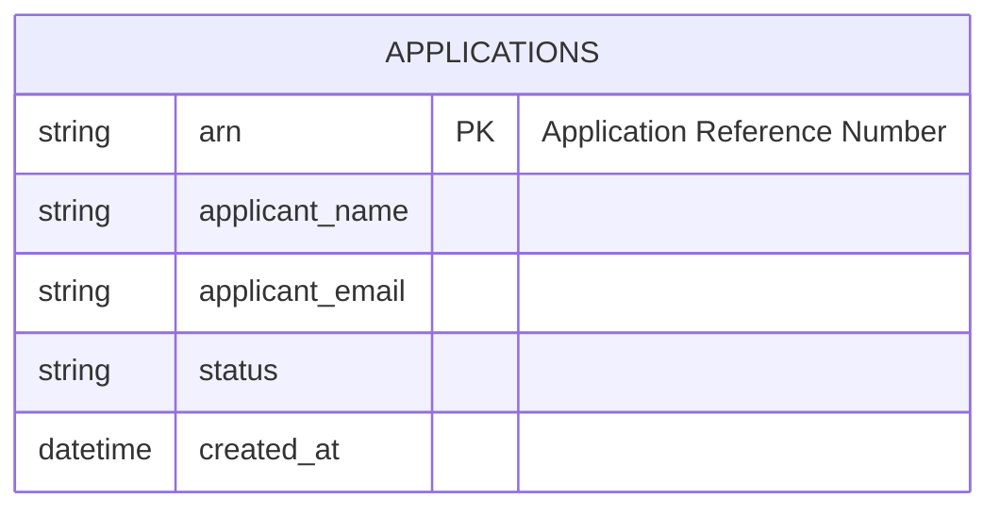

# Implementation Contract — E-001 Intake & Submission

## Data Entities



### Fields

| Field | Type | Constraints | Source FRs |
|---|---|---|---|
| arn | string | pattern: ^ARN-[0-9A-Za-z]{8}$, unique, not null | REQ-001 |
| applicant_email | string (email) | valid email format | REQ-003 |

## API Surface

### POST /api/v1/applications

OpenAPI (partial)

```yaml
openapi: 3.0.0
info:
  title: Intake API
  version: 1.0.0
paths:
  /api/v1/applications:
    post:
      summary: Create application and return ARN
      requestBody:
        required: true
        content:
          application/json:
            schema:
              type: object
              required: [applicant_name, applicant_email]
              properties:
                applicant_name:
                  type: string
                applicant_email:
                  type: string
                  format: email
      responses:
        '201':
          description: Created
          content:
            application/json:
              schema:
                type: object
                properties:
                  arn:
                    type: string
                    example: ARN-1A2B3C4D
        '400':
          description: Validation error
```

## Events

- `application.submitted` — payload: { arn, applicant_email, created_at }

## Business Rules

- ARN must be stable and unique. Duplicate submissions with same payload must return the same ARN (idempotency key based on applicant email + normalized payload).
