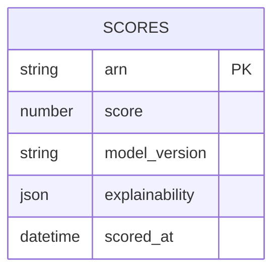

# Implementation Contract — E-002 AI Scoring & Risk Decisions

## Data Entities



## API Surface

### POST /api/v1/score

```yaml
openapi: 3.0.0
info:
  title: Scoring API
  version: 1.0.0
paths:
  /api/v1/score:
    post:
      summary: Request a score for an ARN
      requestBody:
        required: true
        content:
          application/json:
            schema:
              type: object
              required: [arn]
              properties:
                arn:
                  type: string
      responses:
        '200':
          description: Score produced
          content:
            application/json:
              schema:
                type: object
                properties:
                  score:
                    type: number
                  model_version:
                    type: string
```

## Events

- `score.generated` — payload includes arn, score, model_version, explainability_meta

## Non-Functional Constraints

- Explainability export must be storable and queryable; scoring must complete within 2s for 95th percentile.
