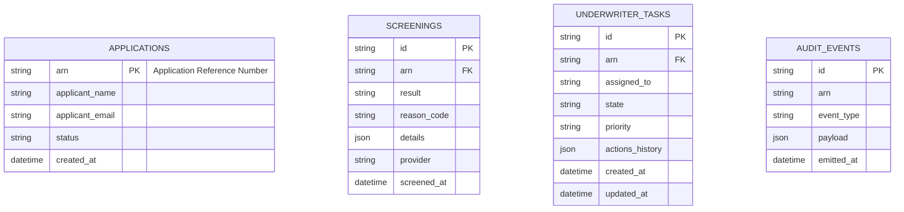

# Implementation Contract — E-003 Compliance & Underwriter Workflows

## Data Entities



### SCREENINGS

| Field | Type | Constraints | Source |
|---|---|---|---|
| id | string | uuid-like, PK | REQ-006 |
| arn | string | FK -> APPLICATIONS.arn | REQ-006 |
| result | string | one of: PASS, REVIEW, BLOCK | REQ-006 |
| reason_code | string | enumerated per provider | REQ-006 |
| details | json | provider payload, redacted PII as required | REQ-013 |
| provider | string | e.g., Experian, internal | REQ-005 / REQ-006 |
| screened_at | datetime | ISO 8601 | REQ-006 |

### UNDERWRITER_TASKS

| Field | Type | Constraints | Source |
|---|---|---|---|
| id | string | uuid-like, PK | REQ-009 |
| arn | string | FK -> APPLICATIONS.arn | REQ-009 |
| assigned_to | string | underwriter id or group | REQ-010 |
| state | string | NEW, ASSIGNED, IN_PROGRESS, APPROVED, REFERRED, ESCALATED | REQ-010 |
| priority | string | LOW, MEDIUM, HIGH | REQ-010 |
| actions_history | json | list of {actor, action, timestamp, note} | REQ-011 |
| created_at | datetime | ISO 8601 | REQ-009 |
| updated_at | datetime | ISO 8601 | REQ-010 |

### AUDIT_EVENTS

| Field | Type | Constraints | Source |
|---|---|---|---|
| id | string | uuid-like, PK | REQ-013 |
| arn | string | may be null for system events | REQ-013 |
| event_type | string | e.g., screening.completed, task.actioned | REQ-013 |
| payload | json | must include correlation id and actor | REQ-022 |
| emitted_at | datetime | ISO 8601 | REQ-013 |

## API Surface

### POST /api/v1/compliance/aml-screenings

```yaml
openapi: 3.0.3
info:
  title: Compliance API
  version: 1.0.0
paths:
  /api/v1/compliance/aml-screenings:
    post:
      summary: Request AML/KYC screening for an application ARN
      operationId: requestAmlScreening
      requestBody:
        required: true
        content:
          application/json:
            schema:
              type: object
              required: [arn]
              properties:
                arn:
                  type: string
                  description: Application Reference Number
                provider:
                  type: string
                  description: Optional screening provider override
      responses:
        '202':
          description: Screening accepted
          content:
            application/json:
              schema:
                type: object
                properties:
                  id:
                    type: string
                    format: uuid
        '400':
          description: Validation error
        '422':
          description: Business rule violation

  /api/v1/underwriter/tasks:
    get:
      summary: List tasks for underwriter queue
      parameters:
        - in: query
          name: assigned_to
          schema:
            type: string
      responses:
        '200':
          description: Task list
          content:
            application/json:
              schema:
                type: array
                items:
                  type: object
                  properties:
                    id:
                      type: string
                    arn:
                      type: string

  /api/v1/underwriter/tasks/{id}/actions:
    post:
      summary: Perform an action on a task (approve, refer, escalate)
      parameters:
        - in: path
          name: id
          required: true
          schema:
            type: string
      requestBody:
        required: true
        content:
          application/json:
            schema:
              type: object
              required: [action, actor]
              properties:
                action:
                  type: string
                  enum: [approve, refer, escalate]
                actor:
                  type: string
                note:
                  type: string
      responses:
        '200':
          description: Action accepted
        '400':
          description: Validation error
        '404':
          description: Task not found

components:
  securitySchemes:
    bearerAuth:
      type: http
      scheme: bearer
      bearerFormat: JWT

### Consumed APIs (External)

| API | Provider | Timeout | Fallback | Circuit Breaker |
|---|---|---|---|---|
| Credit check | Experian | 3000 ms | mark as REVIEW and queue for retry | threshold 5 failures / 1m |

## Events

- `screening.completed` — producer: Compliance Service — payload: { id, arn, result, reason_code, provider, screened_at }
- `task.actioned` — producer: Underwriter Service — payload: { task_id, arn, actor, action, note, timestamp }
- `audit.event` — producer: any service — payload: { id, arn, event_type, payload, emitted_at }

Each event must include `correlation_id` and `trace_id`. Delivery: at-least-once. Idempotency keys: use event `id` and `arn` where applicable.

## Business Rules

| Rule | Condition | Effect | Source |
|---|---|---|---|
| BR-003 | If screening result == BLOCK | Auto-block application status and create immediate escalation task | REQ-006 |
| BR-004 | If screening result == REVIEW | Create underwriter task with priority based on risk score | REQ-006, REQ-009 |
| BR-005 | Underwriter action must record actor and reason | Persist to UNDERWRITER_TASKS.actions_history and emit `task.actioned` | REQ-010, REQ-011 |

## Non-Functional Constraints

| Constraint | Target | Source |
|---|---|---|
| Screening latency < 5s (p95) | Compliance Service | NFR-005 |
| Underwriter action persistence within 2s | Underwriter Service | REQ-010 |
| Audit events retained for 7 years (regulatory) | Audit store | REQ-013 |

## Open Design Questions

| Question | Impact | Must Resolve Before |
|---|---|---|
| Which PII redaction standard applies to stored `details` payload? | Affects storage format and compliance | Implementation start |
| Should underwriter tasks be partitioned by region or by workload? | Affects scalability and routing | Design handoff |
