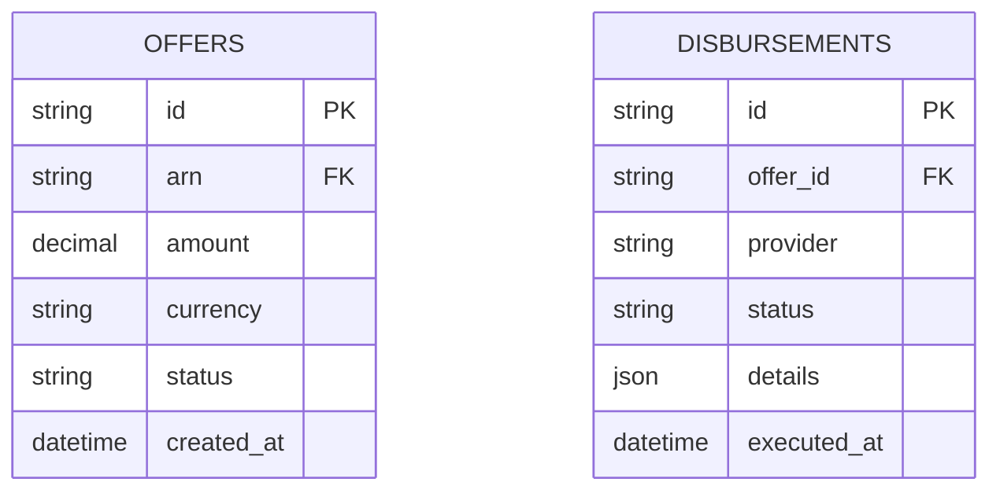

# Implementation Contract — E-004 Offer Generation & Disbursement

## Data Entities



## API Surface

### POST /api/v1/offers

Creates an offer for a given ARN. Response contains offer id and status.

```yaml
openapi: 3.0.3
info:
  title: Offer API
  version: 1.0.0
paths:
  /api/v1/offers:
    post:
      summary: Create offer for an application
      requestBody:
        required: true
        content:
          application/json:
            schema:
              type: object
              required: [arn, amount, currency]
              properties:
                arn:
                  type: string
                amount:
                  type: number
                currency:
                  type: string
      responses:
        '201':
          description: Created
          content:
            application/json:
              schema:
                type: object
                properties:
                  id:
                    type: string
                    format: uuid
  /api/v1/disbursements:
    post:
      summary: Execute a disbursement for an offer
      requestBody:
        required: true
        content:
          application/json:
            schema:
              type: object
              required: [offer_id, provider]
              properties:
                offer_id:
                  type: string
                provider:
                  type: string
      responses:
        '200':
          description: Disbursement executed
```

## Events

- `offer.generated`, `offer.accepted`, `disbursement.executed`

## Business Rules

- Offer must include APR and terms and be immutable once accepted.

## Non-Functional Constraints

- Reconciliation must complete within 24 hours of disbursement.

## Open Questions

- Which payment providers will be supported initially?
