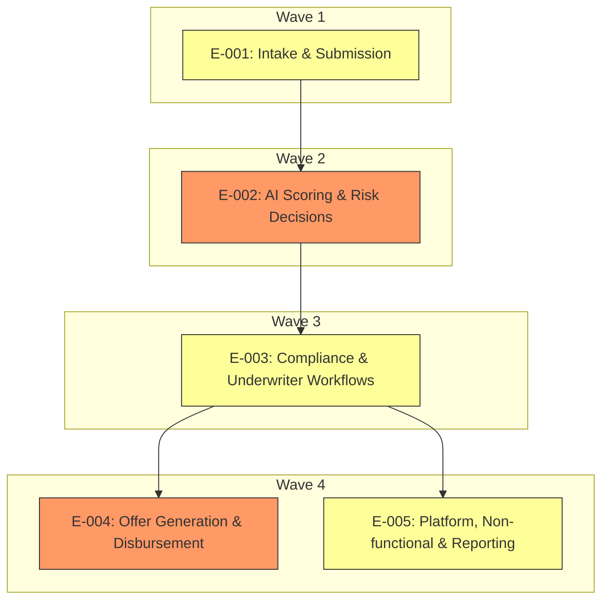

# Elaboration Plan

## Metadata

| Field | Value |
|---|---|
| Initiative ID | I988-N8 |
| Created at | 2026-06-21 |
| Created by | delivery-lead |
| Status | Draft |

---

## Elaboration Strategy Summary

This plan sequences epic elaboration to balance foundation-first, risk-first, and business-priority concerns. It aims to surface high-risk technical work early (AI scoring, external integrations) while enabling parallel elaboration where dependencies permit.

| Strategy | Description |
|---|---|
| Foundation-first | Prioritise epics that provide core identifiers and data (E-001) so downstream elaboration can proceed reliably |
| Risk-first | Deliver high-risk components early (E-002) to validate technical approach and regulator-facing explainability |

## Elaboration Order

| Wave | Epics | Rationale |
|---|---|---|
| Wave 1 | E-001 | Foundation: intake and ARN generation; most epics depend on intake data and ARN as the primary identifier |
| Wave 2 | E-002 | Risk-first: AI scoring is high-risk; implement early to fail fast and validate explainability requirements |
| Wave 3 | E-003 | Dependent on scoring outputs and compliance integration; address AML/KYC flows next |
| Wave 4 | E-004, E-005 | Parallel: disbursement and platform/non-functional work can be elaborated in parallel after scoring and compliance are stable |

## Elaboration Dependency Diagram

## Prioritisation Criteria and Weights

- Foundation-first (weight 40%): ensures data and identifiers (ARN) are available to downstream work — supported by architecture-review noting ARN as central.
- Risk-first (weight 30%): earlier delivery of high-risk AI scoring (E-002) to validate explainability and model contracts.
- Business-priority (weight 20%): Must-have epics (E-001, E-002, E-003) prioritized over Should/Could.
- Independence (weight 10%): enable parallel elaboration where dependencies permit (Wave 4 parallelism for E-004 and E-005).

Rationale: We derived risk levels from `architecture/architecture-review.md` (external integrations and T24 have high blast radius; AI scoring requires explainability). Foundation-first is applied because most flows require ARN and intake data.

## Epic Dependency Analysis

| Epic | Depends On | Depended On By | Risk |
|---|---|---|---|
| E-001 | None | E-002, E-003, E-005 | Medium |
| E-002 | E-001 | E-003, E-005 | High |
| E-003 | E-002 | E-004, E-005 | Medium-High |
| E-004 | E-003 | None | High |
| E-005 | E-001,E-002,E-003 | None | Medium |

## Parallel Elaboration Opportunities

- Wave 4 parallel group: `E-004` and `E-005` can be elaborated in parallel because both depend on E-003 but do not depend on each other. Constraints: ensure shared interfaces (e.g., audit event schema, disbursement contract) are agreed early to avoid rework.

| Parallel Group | Epics | Constraints |
|---|---|---|
| Wave 4 Parallel | E-004, E-005 | Shared contracts (audit events, payment instruction schema) must be finalised before parallel work |

## Risks and Mitigations

| Risk | Impact | Mitigation |
|---|---|---|
| External API contract changes (Experian/T24) | May delay E-002/E-004 work or require rework | Early contract tests and stubs; include API contract negotiation in Wave 1 tasks |
| AI explainability gaps | E-002 may not meet regulator requirements, blocking downstream | Prototype explainability exporter early; tests for provenance |
| Resource contention for platform infra | Parallel elaboration may be slower if infra team overloaded | Reserve infra sprint capacity and use feature toggles for incremental rollout |

## Recommendations (2-3 sentences)

Start with `E-001` in Wave 1 to establish ARN and intake flows, then focus Wave 2 on `E-002` (AI scoring) to validate explainability and model contracts early. After scoring is stable, elaborate `E-003` (Compliance & Underwriter) and then run Wave 4 with `E-004` and `E-005` in parallel, ensuring API contracts and event schemas are locked before parallel work begins.

---
*Set Status: Confirmed only after review. Never self-accept.*
